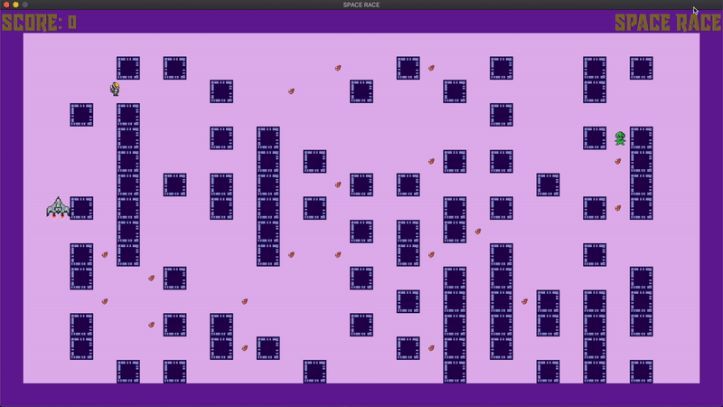
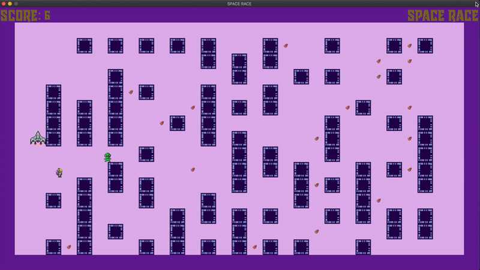
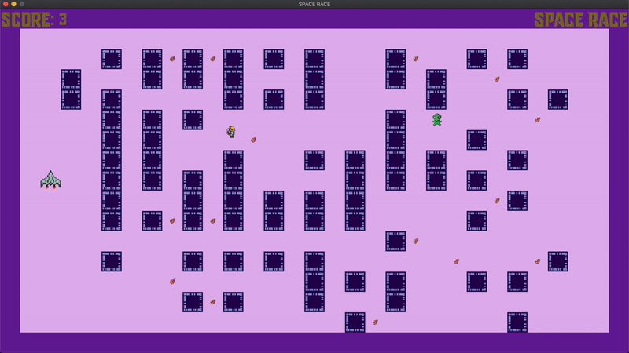

# Space Race
A simple 2-player Rust game built on top of the [Bevy framework](https://bevyengine.org)

## How to Play

The Astronaut moves around collecting jewels (using WASD keys). The Alien moves around trying to catch the Astronaut (using arrow keys). 

The Astronaut wins if they collect at least 5 jewels and make it back to home base before the Alien catches them. 

The Alien wins otherwise. 

## Blog Post

http://datasieve.blogspot.com/2020/09/space-race-simple-rust-game-built-on.html 
